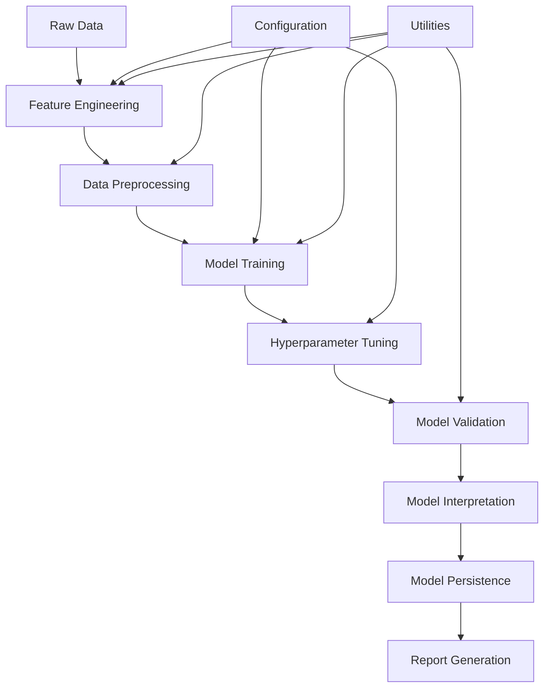

# Design Document

## Overview

The ML Pipeline Enhancement extends the existing EDA notebook with a comprehensive machine learning system for HP product authenticity classification. The system will transform raw product data into engineered features, train multiple classification models, perform hyperparameter optimization, and provide detailed model evaluation and interpretation capabilities.

The design follows a modular approach with clear separation of concerns, enabling easy maintenance, testing, and future enhancements. The pipeline will be implemented as additional notebook sections that can be executed sequentially after the existing EDA analysis.

## Architecture

### High-Level Architecture



### Data Flow

1. **Input**: Labeled dataset from existing EDA pipeline (`df_labeled`)
2. **Feature Engineering**: Transform raw features into ML-ready format
3. **Preprocessing**: Scale, encode, and split data
4. **Training**: Train multiple models with cross-validation
5. **Optimization**: Tune hyperparameters for best performance
6. **Validation**: Evaluate models using multiple metrics
7. **Interpretation**: Analyze feature importance and model behavior
8. **Output**: Trained models, evaluation reports, and visualizations

## Components and Interfaces

### 1. Feature Engineering Module

**Purpose**: Transform raw product data into meaningful features for ML models

**Key Functions**:
- `create_text_features()`: Generate TF-IDF vectors from titles and descriptions
- `create_numerical_features()`: Scale and normalize numerical columns
- `create_categorical_features()`: Encode categorical variables
- `create_derived_features()`: Generate price ratios, text metrics, keyword indicators
- `remove_correlated_features()`: Handle multicollinearity

**Input**: Raw DataFrame with columns: title, description, price_numeric, seller_name, rating_numeric, reviews_count, platform, product_type, heuristic features
**Output**: Feature matrix (X) and target vector (y)

### 2. Model Training Module

**Purpose**: Train and evaluate multiple classification algorithms

**Key Functions**:
- `train_random_forest()`: Train Random Forest classifier
- `train_svm()`: Train Support Vector Machine
- `train_logistic_regression()`: Train Logistic Regression
- `train_gradient_boosting()`: Train Gradient Boosting classifier
- `cross_validate_model()`: Perform k-fold cross-validation
- `handle_class_imbalance()`: Apply SMOTE or class weighting

**Input**: Feature matrix (X), target vector (y)
**Output**: Trained models with cross-validation scores

### 3. Hyperparameter Optimization Module

**Purpose**: Automatically optimize model hyperparameters

**Key Functions**:
- `define_param_grids()`: Define search spaces for each algorithm
- `grid_search_optimization()`: Perform grid search with CV
- `random_search_optimization()`: Perform randomized search
- `bayesian_optimization()`: Advanced optimization technique
- `save_best_params()`: Store optimal parameters

**Input**: Base models, parameter grids
**Output**: Optimized models with best parameters

### 4. Model Validation Module

**Purpose**: Comprehensive model evaluation and comparison

**Key Functions**:
- `calculate_metrics()`: Compute precision, recall, F1, AUC-ROC
- `generate_confusion_matrix()`: Create confusion matrix visualizations
- `create_roc_curves()`: Plot ROC curves for model comparison
- `cross_validation_analysis()`: Detailed CV performance analysis
- `model_comparison_table()`: Side-by-side performance comparison

**Input**: Trained models, test data
**Output**: Performance metrics, visualizations, comparison reports

### 5. Model Interpretation Module

**Purpose**: Explain model predictions and feature importance

**Key Functions**:
- `feature_importance_analysis()`: Calculate and visualize feature importance
- `prediction_explanation()`: Explain individual predictions
- `create_feature_plots()`: Generate feature importance visualizations
- `analyze_prediction_confidence()`: Assess prediction reliability
- `generate_interpretation_report()`: Create comprehensive interpretation document

**Input**: Trained models, feature names, test predictions
**Output**: Feature importance rankings, explanation visualizations, interpretation reports

### 6. Model Persistence Module

**Purpose**: Save and load trained models with metadata

**Key Functions**:
- `save_model()`: Serialize model with metadata
- `load_model()`: Deserialize model and verify compatibility
- `save_pipeline()`: Save complete preprocessing + model pipeline
- `model_versioning()`: Track model versions and performance
- `validate_model_schema()`: Ensure data compatibility

**Input**: Trained models, preprocessing pipelines, metadata
**Output**: Serialized model files, version tracking

### 7. Report Generation Module

**Purpose**: Create comprehensive evaluation and business reports

**Key Functions**:
- `generate_technical_report()`: Detailed technical analysis
- `create_executive_summary()`: High-level business summary
- `export_to_pdf()`: Generate PDF reports
- `create_html_dashboard()`: Interactive HTML dashboard
- `model_recommendation()`: Provide model selection recommendations

**Input**: Model results, performance metrics, visualizations
**Output**: PDF/HTML reports, dashboards, recommendations

## Data Models

### Feature Schema

```python
class FeatureSchema:
    # Text Features (TF-IDF)
    title_tfidf: sparse_matrix  # TF-IDF vectors from titles
    description_tfidf: sparse_matrix  # TF-IDF vectors from descriptions
    
    # Numerical Features (scaled)
    price_scaled: float  # Normalized price
    rating_scaled: float  # Normalized rating
    reviews_count_scaled: float  # Normalized review count
    
    # Categorical Features (encoded)
    platform_encoded: int  # Platform one-hot encoding
    product_type_encoded: int  # Product type encoding
    seller_encoded: int  # Seller label encoding
    
    # Derived Features
    price_per_rating: float  # Price/rating ratio
    title_length: int  # Title character count
    description_length: int  # Description character count
    has_hp_keyword: bool  # Contains "HP" in title
    has_original_keyword: bool  # Contains "original" in title
    
    # Heuristic Features (existing)
    is_original: bool
    is_xl: bool
    has_sealed_info: bool
    has_invoice_info: bool
    has_warranty_info: bool
    confidence: float
```

### Model Metadata Schema

```python
class ModelMetadata:
    model_name: str
    algorithm: str
    training_date: datetime
    performance_metrics: dict
    feature_names: list
    hyperparameters: dict
    cross_validation_scores: dict
    data_schema_version: str
    preprocessing_steps: list
```

## Error Handling

### Data Quality Issues
- **Missing Values**: Imputation strategies for numerical and categorical features
- **Outliers**: Detection and handling using IQR or Z-score methods
- **Data Drift**: Validation of new data against training distribution
- **Schema Changes**: Graceful handling of column additions/removals

### Model Training Issues
- **Convergence Problems**: Automatic parameter adjustment and algorithm switching
- **Memory Constraints**: Batch processing and feature selection for large datasets
- **Class Imbalance**: Automatic detection and correction using SMOTE/class weights
- **Overfitting**: Early stopping and regularization parameter tuning

### Performance Issues
- **Long Training Times**: Progress indicators and time estimation
- **Resource Constraints**: Memory-efficient algorithms and data sampling
- **Hyperparameter Search**: Intelligent search space reduction
- **Model Serialization**: Fallback options for large model files

## Testing Strategy

### Unit Testing
- **Feature Engineering**: Test each transformation function with known inputs/outputs
- **Model Training**: Verify model training with synthetic data
- **Metrics Calculation**: Validate metric computations against known results
- **Data Preprocessing**: Test encoding and scaling functions

### Integration Testing
- **End-to-End Pipeline**: Test complete workflow from raw data to trained model
- **Model Persistence**: Verify save/load functionality maintains model performance
- **Cross-Validation**: Ensure CV results are consistent and reproducible
- **Report Generation**: Test report creation with various model configurations

### Performance Testing
- **Training Speed**: Benchmark training times for different data sizes
- **Memory Usage**: Monitor memory consumption during feature engineering
- **Prediction Latency**: Measure inference time for real-time applications
- **Scalability**: Test with varying dataset sizes and feature counts

### Validation Testing
- **Model Accuracy**: Verify models meet minimum performance thresholds
- **Feature Importance**: Validate that important features make business sense
- **Prediction Consistency**: Ensure consistent predictions across runs
- **Cross-Platform**: Test compatibility across different Python environments

## Configuration Management

### Model Configuration
```python
MODEL_CONFIG = {
    'random_forest': {
        'n_estimators': [100, 200, 300],
        'max_depth': [10, 20, None],
        'min_samples_split': [2, 5, 10]
    },
    'svm': {
        'C': [0.1, 1, 10],
        'kernel': ['rbf', 'linear'],
        'gamma': ['scale', 'auto']
    },
    'logistic_regression': {
        'C': [0.1, 1, 10],
        'penalty': ['l1', 'l2'],
        'solver': ['liblinear', 'saga']
    }
}
```

### Feature Engineering Configuration
```python
FEATURE_CONFIG = {
    'text_features': {
        'max_features': 1000,
        'min_df': 2,
        'max_df': 0.95,
        'ngram_range': (1, 2)
    },
    'numerical_scaling': 'StandardScaler',
    'categorical_encoding': 'OneHotEncoder',
    'correlation_threshold': 0.95
}
```

### Validation Configuration
```python
VALIDATION_CONFIG = {
    'test_size': 0.2,
    'cv_folds': 5,
    'random_state': 42,
    'stratify': True,
    'min_accuracy_threshold': 0.8,
    'metrics': ['accuracy', 'precision', 'recall', 'f1', 'roc_auc']
}
```